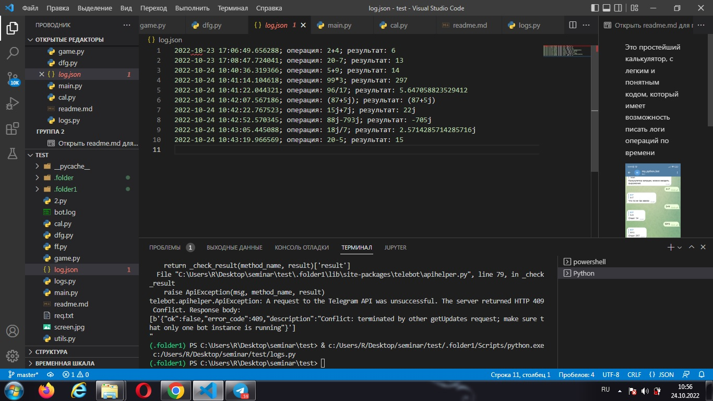
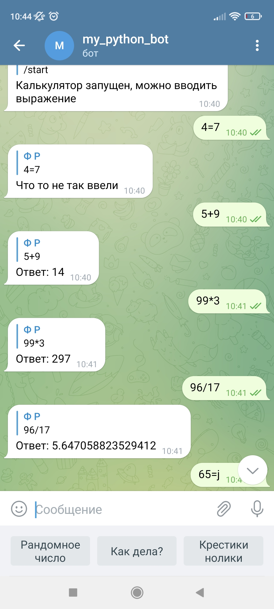

Это простейший калькулятор, с легким и понятным кодом, который имеет возможность писать логи операций по времени

Калькулятор состоит из двух модулей:

**Модуль cal** - запускает калькулятор и обрабаывает ввод.  
**Модуль logs** - саписывает и сохраняет логи калькулятора.